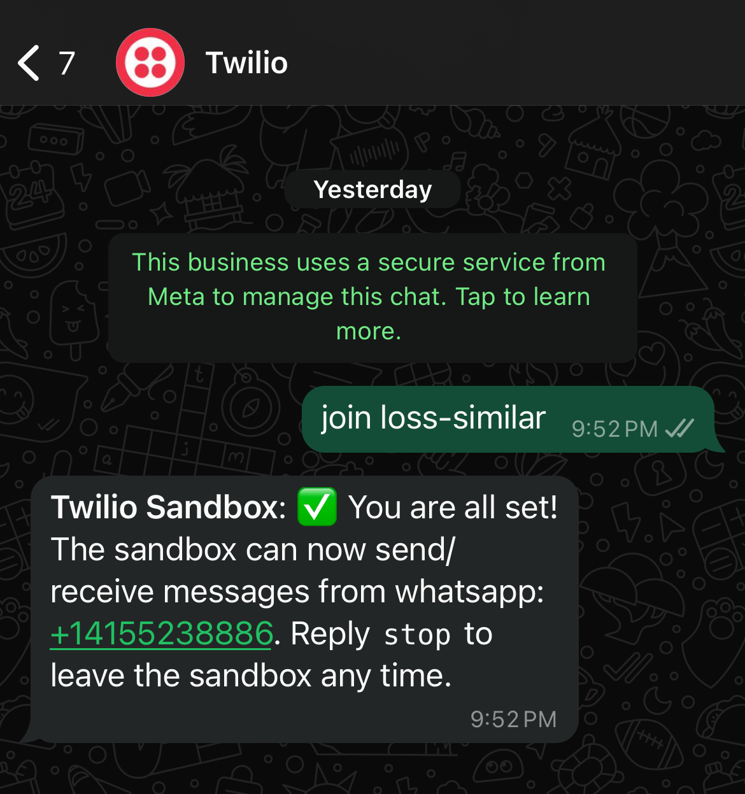

## FLASK-WHATSAPP-BOT
### Overview
FLASK-WHATSAPP-BOT is a whatsapp bot built using Flask and the Twilio API, designed to extract and summarize content from URLs shared within WhatsApp messages. By using the Natural Language Processing (NLP) with the nltk library, the bot provides a concise summaries of web content, reducing the need to open the link for full details.
### Motivation
The motivation behind this bot comes from the frequent appearance of Facebook posts with engaging headlines that promise news or a story but often lead to external sites with clickbait content. This bot allows users to bypass the clickbait by directly summarizing the content, saving time and reducing frustration from misleading headlines.
### Features
1. Link Extraction: Automatically detects URLs in incoming WhatsApp messages.
2. Content Summarization: Uses NLP to summarize the content of articles or any link in messages.
3. Scalable: Built with Flask and Twilio API to handle backend communication and messaging.

### Technology Stack
Languages: Python  
Frameworks & Libraries: Flask, nltk  
APIs: Twilio API  
Hosting: Heroku  

### How to Use
## Send an intial message "join loss-similar" to +1 (415)523-8886 for setup and you are good to go. Send the URLs and get the summaries.

1. 

### Future Improvements
1. Enhance NLP model for better summarization
