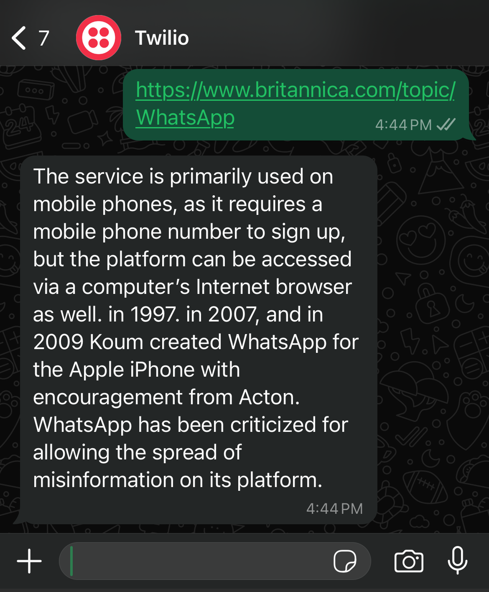

## FLASK-WHATSAPP-BOT
### 👋 Overview
FLASK-WHATSAPP-BOT is a whatsapp bot built using Flask and the Twilio API, designed to extract and summarize content from URLs shared within WhatsApp messages. By using the Natural Language Processing (NLP) with the nltk library, the bot provides a concise summaries of web content, reducing the need to open the link for full details.
### ✨ Motivation
Have you ever clicked on a Facebook post with a headline that sounds too good to be true, only to be greeted with a clickbait-laden article that leaves you questioning your life choices? Yeah, me too. That's why I built this bot. It skips the endless cycle of disappointment by summarizing the content of those "engaging" links, so you can avoid wasting time on clickbait and get straight to the point. Because, honestly, nobody has time for that!

### 🔨 How to Use it
## Send an intial message "join loss-similar" to +1 (415)523-8886 for setup and you are good to go. Send the URLs and get the summaries.

### 📋 Features
1. Link Extraction: Automatically detects URLs in incoming WhatsApp messages.
2. Content Summarization: Uses NLP to summarize the content of articles or any link in messages.
3. Scalable: Built with Flask and Twilio API to handle backend communication and messaging.

### 🔨 Tech Stack
Languages: Python  
Frameworks & Libraries: Flask, nltk  
APIs: Twilio API  
Hosting: Heroku  

### Future Improvements
1. Enhance NLP model for better summarization
